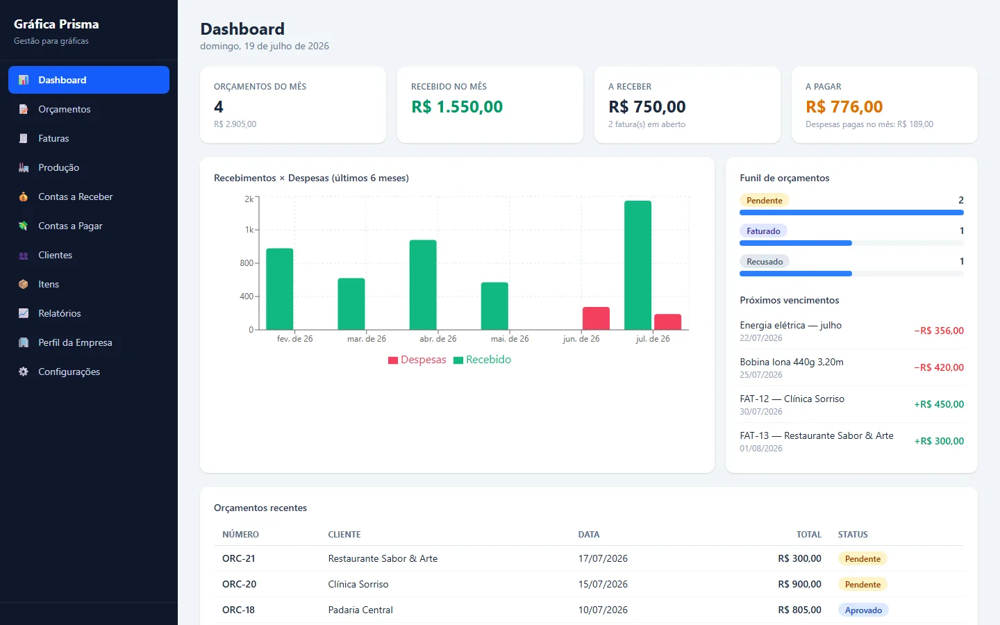

# Gráfica Livre

Sistema de gestão **gratuito e open source** para gráficas rápidas e comunicação visual:
orçamentos, faturas, produção, financeiro e relatórios — tudo em português, num app só.



## Recursos

- **Orçamentos** com cálculo automático de R$/m², PDF com a sua marca e envio por WhatsApp
- **Faturas** convertidas do orçamento em um clique, com PIX (QR code), pagamentos parciais e guia de remessa para o entregador
- **Produção em kanban**: arte → impressão → acabamento → pronto → entregue, com alerta de prazo
- **Financeiro**: contas a pagar e a receber, fluxo de vencimentos
- **Relatórios**: indicadores do mês e gráficos de recebimentos × despesas
- **Backup**: exporte e importe todos os dados em JSON

> Todos os valores monetários são armazenados em **centavos** (inteiros).

## Começando (modo local — zero configuração)

Requer [Node.js](https://nodejs.org) 20+.

```bash
git clone https://github.com/0brunox/grafica-livre.git
cd grafica-livre
npm install
npm run dev
```

Abra http://localhost:5173 — o app roda em **modo local**, guardando os dados no
localStorage do navegador. Ideal para testar ou para uso individual num único computador.

## Modo nuvem (Supabase — gratuito)

Para acessar de vários dispositivos, com login e dados no banco:

1. Crie um projeto gratuito no [Supabase](https://supabase.com).
2. No **SQL Editor** do projeto, cole e execute o conteúdo de [`supabase/schema.sql`](supabase/schema.sql)
   (cria tabelas, RLS e a função de numeração atômica — seguro rodar mais de uma vez).
3. Em **Authentication → Users**, crie seu usuário (e-mail/senha).
4. Copie `.env.example` para `.env` e preencha com os valores de **Settings → API**:

   ```
   VITE_SUPABASE_URL=https://SEU-PROJETO.supabase.co
   VITE_SUPABASE_ANON_KEY=SUA-CHAVE-ANON
   ```

5. `npm run dev` — agora o app abre com landing page + login.

Os dados de cada usuário são isolados por Row Level Security.

## E-mail de faturas (opcional)

O botão "E-mail" das faturas envia o PDF por e-mail usando uma Edge Function do Supabase
com a API do [Resend](https://resend.com) (tem plano gratuito). Se você não configurar,
tudo funciona normalmente — use WhatsApp ou baixe o PDF.

```bash
supabase functions deploy enviar-email
supabase secrets set RESEND_API_KEY=re_xxx EMAIL_REMETENTE="Sua Gráfica <contato@seudominio.com>"
```

## Deploy

O build é 100% estático (`npm run build` → pasta `dist/`), com roteamento por hash —
funciona em qualquer host estático:

- **Vercel**: importe o repositório, framework "Vite", e configure as duas variáveis `VITE_*`.
- **GitHub Pages**: adicione `base: '/grafica-livre/'` no `vite.config.ts` e publique a `dist/`.

## Stack

React 19 · TypeScript · Vite · Tailwind CSS 4 · Supabase (opcional) · pdfmake · Recharts

## Contribuindo

Issues e pull requests são bem-vindos! Para desenvolver:

```bash
npm run dev      # servidor de desenvolvimento
npm run lint     # oxlint
npm run build    # typecheck + build de produção
```

## Licença

[MIT](LICENSE) © 2026 Bruno Santos
